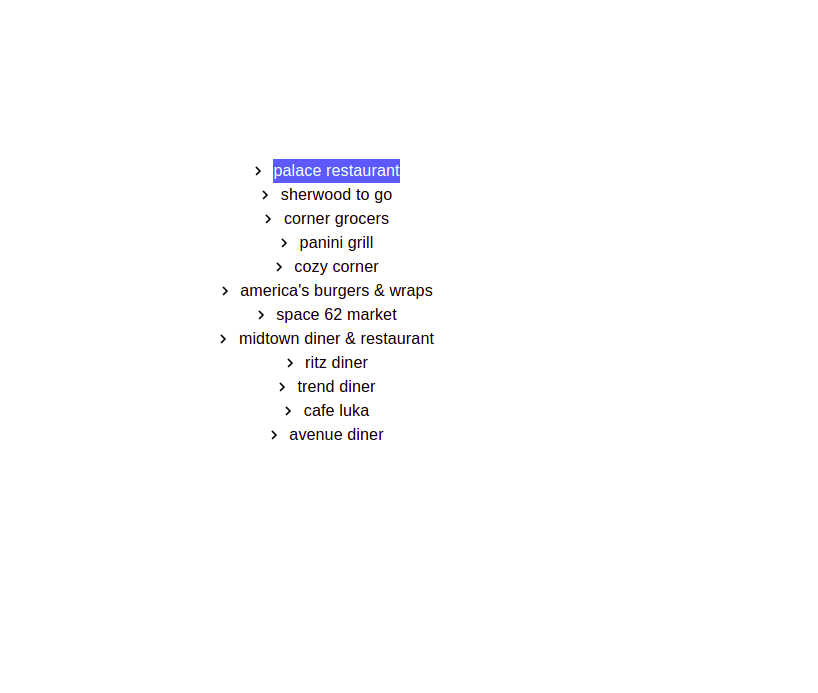
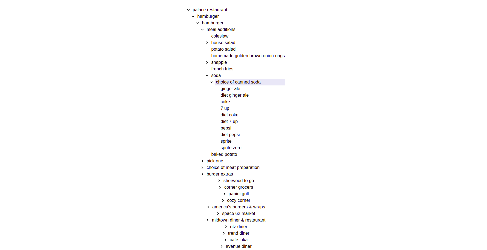

## What's this?

[Smarter Codes Tech Challenge](https://smarter.codes/)  UI of tree View. :blush:

### Screenshot


<br></br>



#
## How to ...

### ... live demo:

[Link:](https://treeview-247c1.web.app/)
```bash
https://treeview-247c1.web.app
```

### ... run locally?

Make sure you have [Node](https://nodejs.org/en/) and [git](https://git-scm.com/) installed.

- Clone the repo:

  ```bash
  git clone https://github.com/sagarjsr/tree-view.git
  cd tree-view
  ```

- Install the dependencies:

  ```bash
  npm install
  ```

- Fire up a development server:

  ```bash
  npm start
  ```

# Smarter Codes Tech Challenge